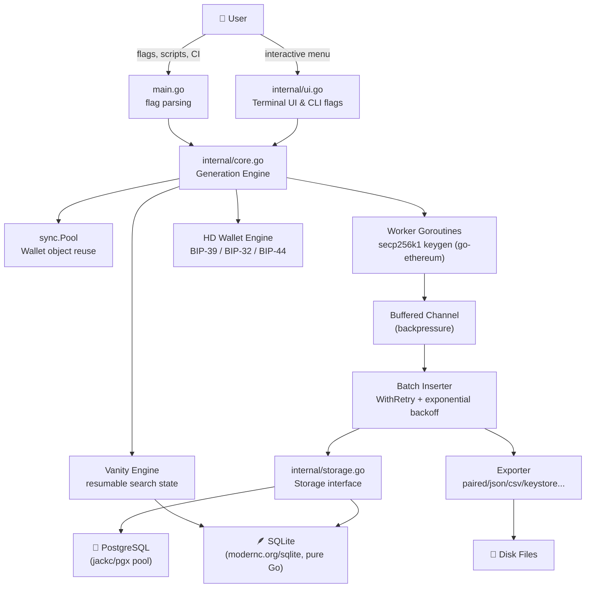

<div align="center">

# 🔐 EVM Wallet Generator

### High-Performance Ethereum-Compatible Wallet Generation Toolkit, Written in Go

[](https://go.dev)
[](LICENSE)
[](#-database-layer)
[](#-contributing)
[](https://github.com/ethereum/go-ethereum)

**Generate thousands of secp256k1 keypairs per second · BIP‑39/BIP‑44 HD wallets · Vanity address mining · Zero‑config embedded storage**

[Features](#-features) • [Installation](#-installation-guide) • [Quick Start](#-quick-start-guide) • [Configuration](#%EF%B8%8F-configuration-guide) • [Architecture](#-architecture) • [Roadmap](#%EF%B8%8F-roadmap) • [Contributing](#-contributing)

</div>

---

## 🤔 Why This Project Exists

Generating EVM-compatible (Ethereum, BSC, Polygon, Arbitrum, Optimism, Base, and any other EVM chain) wallets sounds trivial — call a crypto library, get a keypair. But **doing it at scale, safely, and ergonomically** is a different problem entirely:

- 🐢 Most scripts generate wallets one at a time, with no concurrency model.
- 💾 Most tools have nowhere durable to put the results — you end up with a CSV you're scared to lose.
- 🎯 Vanity address generation (e.g. an address starting with `0xdead...`) is computationally expensive and almost nobody builds resumable search state for it.
- 🌱 HD wallet derivation (BIP‑39/BIP‑44) is usually a separate tool from bulk random generation.
- 🔌 Postgres-backed tools usually assume you already have Postgres running; SQLite-only tools don't scale to a real backend.

**EVM Wallet Generator** solves all of this in a single, dependency-light Go binary: a concurrent generation engine capable of **thousands of wallets per second**, an embedded zero-setup SQLite store with an optional PostgreSQL upgrade path, a resumable vanity-address miner, full HD wallet support, and six plaintext/keystore export formats — wrapped in a polished interactive terminal UI **and** a scriptable non-interactive CLI mode.

---

## 📚 Table of Contents

- [✨ Features](#-features)
- [💻 Installation Guide](#-installation-guide)
- [⚡ Quick Start Guide](#-quick-start-guide)
- [⚙️ Configuration Guide](#%EF%B8%8F-configuration-guide)
- [🏗️ Architecture](#%EF%B8%8F-architecture)
- [🗄️ Database Layer](#%EF%B8%8F-database-layer)
- [🔒 Security Considerations](#-security-considerations)
- [🚀 Performance](#-performance)
- [📁 Project Structure](#-project-structure)
- [🧭 Example Workflows](#-example-workflows)
- [🖼️ Screenshots](#%EF%B8%8F-screenshots)
- [🗺️ Roadmap](#%EF%B8%8F-roadmap)
- [🤝 Contributing](#-contributing)
- [🤖 AI-Assisted Development](#-ai-assisted-development)
- [✅ Community Checklist](#-community-checklist)
- [🐛 Issue Templates](#-issue-templates)
- [🍴 Fork & Improve](#-fork--improve)
- [📄 License](#-license)
- [💬 Final Word](#-final-word)

---

## ✨ Features

Everything below is verified against the source code — nothing here is aspirational. (Aspirational ideas live in the [Roadmap](#%EF%B8%8F-roadmap).)

### 🎲 Random Wallet Generation

**What it does:** Generates cryptographically secure secp256k1 keypairs using `go-ethereum`'s `crypto.GenerateKey()`, derives the Ethereum address via Keccak‑256, and persists batches concurrently.

**Why it exists:** This is the core use case — bulk-producing fresh, never-seen-before EVM addresses for testing, airdrops, sharding, research, or any workflow that needs disposable wallets.

**How it's engineered:**
- A **worker pool** (size = `cfg.Workers`, auto-tuned to `runtime.NumCPU()` when unset) generates wallets in parallel into a buffered channel.
- A **`sync.Pool`** of pre-allocated `Wallet` structs (warmed at startup with `runtime.NumCPU() × 16`, clamped between 100–256 objects) eliminates per-wallet heap allocation churn — `GenerateInto()` reuses byte slices via `copy()` instead of allocating new ones.
- A single inserter goroutine batches confirmed wallets (`cfg.BatchSize`, default 500, capped at 1000) and writes them with **retried, exponential-backoff** storage calls (`WithRetry`, 3 attempts, 100ms → 5s backoff).
- After each batch is inserted, **private key and address bytes are explicitly zeroed** before the `Wallet` struct is returned to the pool — reducing the window where sensitive material lingers in reused memory.
- A live, **3-line ANSI progress display** renders a spinner, a 40-character block-character progress bar, live/peak throughput, elapsed time, and ETA at ~8 FPS.

**Use cases:** Pre-generating wallet inventories for dApp testing, bulk address pools for airdrop logistics, load-testing infrastructure that needs "real" EVM addresses, research datasets.

### 🌱 HD Wallet Generation (BIP‑39 / BIP‑44)

**What it does:** Generates or accepts a BIP‑39 mnemonic (12 or 24 words), optionally combines it with a BIP‑39 passphrase ("25th word"), derives a master key via BIP‑32, and walks the standard Ethereum derivation path **`m/44'/60'/0'/0/i`** for as many addresses as requested.

**Why it exists:** Random keypairs aren't recoverable from a memorized phrase. HD wallets are how every real wallet (MetaMask, Ledger, Trust Wallet, etc.) actually works — this mode produces wallets that are **interoperable with those tools.**

**Flow (from `internal/ui.go` → `generateFromSeedPhrase`):**
1. Generate a new 12-word (128-bit entropy) or 24-word (256-bit entropy) mnemonic, **or** paste in an existing one (validated against the BIP‑39 checksum via `tyler-smith/go-bip39`).
2. Optionally supply a passphrase — the UI explains the security trade-offs (extra protection vs. "lose the passphrase, lose the funds forever") in detail before asking.
3. Choose how many addresses to derive (1–100).
4. Each derived `Wallet` carries its `DerivationIndex` and human-readable `DerivationPath` (e.g. `m/44'/60'/0'/0/3`) alongside the address/key.
5. Review the full list in-terminal, then optionally persist to storage and/or export to disk.

**Benefits:** Deterministic recovery from a single seed phrase, compatibility with every standard EVM wallet, auditable derivation paths stored alongside each wallet record.

### 🎯 Vanity Address Generation (with Resume)

**What it does:** Brute-force searches for addresses matching a hex **prefix and/or suffix** pattern (e.g. `0xdead...beef`), with optional **EIP‑55 case-sensitive checksum matching**, supports **multiple OR‑logic patterns** in a single run, and — uniquely — **persists search progress so a Ctrl+C‑interrupted hunt can be resumed later.**

**Why it exists:** Vanity addresses are a real-world EVM use case (branding, easily-recognizable addresses, contract address mining) and computing them correctly requires real difficulty math, not guesswork.

**The math, verified from source:**
| Function | Formula |
|---|---|
| `CalculateDifficulty` | `16^(len(prefix)+len(suffix))`, multiplied by `2^(alphaCount)` if checksum-sensitive (each `a-f` character doubles the search space) |
| `CalculateMultiPatternDifficulty` | Harmonic combination: `1 / Σ(1/dᵢ)` across all OR-patterns |
| `EstimateTime` | 50% confidence = `difficulty × ln(2) / speed`; 99% confidence = `difficulty × ln(100) / speed` |
| `CalculateProbability` | `P = 1 - (1 - 1/difficulty)^attempts` (with an `e^(-attempts/difficulty)` approximation above 10¹⁵ difficulty to avoid float underflow) |

**Operational details:**
- **Speed calibration** (`CalibrateSpeed`) runs a real 1-second multi-worker benchmark before starting, so all time estimates are based on *your* hardware, not a guess.
- A **pre-flight panel** shows pattern(s), checksum mode, difficulty, calibrated speed, 50%/99% time estimates, worker count, and target match count — and if the 50%-confidence ETA exceeds 10 minutes, you're asked to explicitly confirm before burning CPU.
- Matches are streamed through a buffered channel to a collector goroutine, displayed as found, and saved to a **separate `vanity.db` SQLite file** (kept apart from `wallets.db` so vanity hunts don't pollute your main wallet store).
- **Graceful pause/resume:** every 5 seconds (and on Ctrl+C / SIGTERM), the current attempt count, match count, and pattern set are persisted to a `vanity_search_state` table. On the next run, if an `active`/`paused` search is found, you're offered the chance to resume exactly where you left off — full attempt count and elapsed time included.

### 🔑 Private Key Import & Verification

**What it does:** Accepts any private key (with or without `0x`), validates hex length/format, derives the EIP‑55 checksummed address, and displays the result — **without ever writing it to the database.**

**Why it exists:** A safe, read-only way to sanity-check a key you already hold, or confirm an address before trusting an exported pair.

### 📤 Multi-Format Wallet Export

**What it does:** Streams every generated wallet to disk in one of **six** configurable formats, fully thread-safe (`sync.Mutex`-guarded) so concurrent batch writers never corrupt output.

| Export Mode | Output | Notes |
|---|---|---|
| `paired` (default) | `address.txt` + `privatekey.txt` | Line-for-line synced, two separate files |
| `key-only` | `privatekey.txt` | Just the private keys |
| `address-only` | `address.txt` | Just the addresses |
| `combined` | `wallets.csv` | Single CSV, header written in overwrite mode |
| `json` | `wallets.json` | Buffered, pretty-printed array; includes `derivation_index`/`derivation_path` when present |
| `keystore` | `keystore/UTC--<timestamp>--<address>` | Web3 Secret Storage (scrypt-encrypted) format via `go-ethereum/accounts/keystore`, requires `KEYSTORE_PASSWORD` |

**Configurable formatting:** EIP‑55 checksum on/off, `0x` prefix on/off independently for addresses and keys, append vs. overwrite, auto-flush every 1,000 records plus an explicit `fsync` on close.

### ✅ Export Verification

**What it does:** A standalone, off-by-default `-verify <file>` CLI flag re-derives every address from its paired private key in an exported `.txt`, `.csv`, or `.json` file and reports a pass/fail count — a cryptographic sanity check that your export wasn't corrupted or mismatched.

> ⚠️ **Known quirk:** `VerifyExportedFile` expects files literally named `addresses.txt` / `keys.txt`, while the default exporter writes `address.txt` / `privatekey.txt` (singular, different name). For now, verifying `paired`-mode exports requires renaming the files first, or using `combined` (CSV) / `json` mode, both of which verify cleanly. This is a great first contribution — see [Contributing](#-contributing).

### 📊 Statistics & Live Status

**What it does:** A boxed-ASCII statistics panel reports total wallets, wallets created today, used/unused counts, total logged events (PostgreSQL only), and database size — backed by `system_stats`, a singleton counter table kept current via PostgreSQL triggers (`O(1)` reads instead of `COUNT(*)` over millions of rows). The main menu's **status strip** shows a live wallet count and active storage backend on every screen.

### 🩺 Health Checks & Database Maintenance (PostgreSQL)

**What it does:** Queries `pg_stat_user_tables` for per-table size, index size, live/dead tuple counts, and last-vacuum timestamps; computes a bloat percentage; flags tables over 20% bloat with a `VACUUM ANALYZE` suggestion; and records every check into a `database_health` history table for trend tracking.

### 🛠️ Benchmark & Tuning Suite

**What it does:** An in-app benchmarking menu that:
- Estimates throughput for your *current* settings without writing to disk (`BenchmarkWalletGeneration` — generation only, storage skipped entirely).
- Runs a quick 1,000-wallet real benchmark.
- Sweeps and compares different worker counts.
- Sweeps and compares different batch sizes.

This turns "what should `WORKERS` be on my machine?" from a guess into a measured answer.

### 🖥️ Dual-Mode Interface

**What it does:** A full interactive terminal UI (ANSI colors auto-detected via `term.IsTerminal` + `NO_COLOR`/`FORCE_COLOR` env var support, single-letter shortcuts like `g`/`v`/`h`/`c`/`i`/`q`) **and** a fully non-interactive flag-driven CLI mode for scripting and CI pipelines — same binary, same engine, two front-ends.

### 💾 Dual Storage Backends

**What it does:** Ships with **zero-setup embedded SQLite** (via `modernc.org/sqlite`, pure-Go, no CGO) as the default, with an **opt-in PostgreSQL backend** for production/scale workloads — including auto-creation of the target database if it doesn't exist yet, configurable connection pooling, and a background pool-usage monitor that warns above a configurable threshold (default 80%).

### 🛡️ Resilience & Graceful Shutdown

**What it does:** SIGINT/SIGTERM are intercepted; in-flight generation is cancelled via `context.WithCancel` and given a 2-second grace period to flush; vanity searches save their progress before exiting; storage writes retry with exponential backoff (3 attempts) before surfacing an error; a top-level `recover()` catches panics and logs them instead of crashing silently.

---

## 💻 Installation Guide

### 📦 Download Pre-built Binaries (Recommended)

Download the latest release for your platform from the [GitHub Releases](https://github.com/vinayakkumar9000/EVM-Wallet-GENERATOR-BOT/releases) page:

- **Windows**: `evmwalletbot-vX.X.X-windows-amd64.zip` or `evmwalletbot-vX.X.X-windows-arm64.zip`
- **Linux**: `evmwalletbot-vX.X.X-linux-amd64.tar.gz` or `evmwalletbot-vX.X.X-linux-arm64.tar.gz`
- **macOS**: `evmwalletbot-vX.X.X-darwin-amd64.tar.gz` or `evmwalletbot-vX.X.X-darwin-arm64.tar.gz`

Each archive contains:
- The `evmwalletbot` executable
- `README.md`
- `LICENSE`

**Verify your download** using the `checksums.txt` file included in the release.

After extracting, check the version:

```bash
# Windows
.\evmwalletbot.exe -version

# Linux/macOS
./evmwalletbot -version
```

### 🔨 Build From Source


### Prerequisites

- **Go 1.25+** (this is a pure-Go module — no CGO toolchain required, even for SQLite)
- *(Optional)* A running **PostgreSQL** server, only if you plan to use `STORAGE=postgres`

### 🪟 Windows

```powershell
# 1. Install Git: https://git-scm.com/download/win
# 2. Install Go: https://go.dev/dl/  (download the .msi installer)

# 3. Clone and build
git clone https://github.com/<your-org>/evm-wallet-generator.git
cd evm-wallet-generator
go build -o evmwalletbot.exe .

# 4. Run
.\evmwalletbot.exe
```

### 🐧 Linux

<details>
<summary><b>Ubuntu / Debian</b></summary>

```bash
sudo apt update
sudo apt install -y git golang-go   # or install the latest Go from https://go.dev/dl/

git clone https://github.com/<your-org>/evm-wallet-generator.git
cd evm-wallet-generator
go build -o evmwalletbot .
./evmwalletbot
```
</details>

<details>
<summary><b>Arch Linux</b></summary>

```bash
sudo pacman -Syu git go

git clone https://github.com/<your-org>/evm-wallet-generator.git
cd evm-wallet-generator
go build -o evmwalletbot .
./evmwalletbot
```
</details>

<details>
<summary><b>Fedora</b></summary>

```bash
sudo dnf install -y git golang

git clone https://github.com/<your-org>/evm-wallet-generator.git
cd evm-wallet-generator
go build -o evmwalletbot .
./evmwalletbot
```
</details>

### 🍎 macOS

```bash
# Using Homebrew
brew install go git

git clone https://github.com/<your-org>/evm-wallet-generator.git
cd evm-wallet-generator
go build -o evmwalletbot .
./evmwalletbot
```

### 🔨 Build From Source (Any Platform)

```bash
git clone https://github.com/<your-org>/evm-wallet-generator.git
cd evm-wallet-generator

# Fetch dependencies (also done automatically by `go build`)
go mod download

# Build a binary for your current OS/arch
go build -o evmwalletbot .

# Cross-compile, e.g. for Linux from any host
GOOS=linux GOARCH=amd64 go build -o evmwalletbot-linux-amd64 .

# Or run directly without producing a binary
go run . -count 100
```

---

## ⚡ Quick Start Guide

```bash
# 🟢 Interactive mode — zero setup, embedded SQLite, full menu UI
./evmwalletbot

# 🚀 Generate 1,000 wallets non-interactively and exit
./evmwalletbot -count 1000

# 📤 Generate 1,000 wallets and export them as a paired txt set
./evmwalletbot -count 1000 -export-mode paired -export-dir ./output

# 📄 Generate and export as a single CSV
./evmwalletbot -count 5000 -export-mode combined -export-dir ./output

# 🐘 Use PostgreSQL instead of SQLite (auto-creates the target DB if missing)
./evmwalletbot -storage postgres

# 📁 Use a custom data directory for the SQLite file
./evmwalletbot -storage sqlite -data-dir ./my-wallets

# ✅ Verify an exported CSV or JSON file's address/key pairs
./evmwalletbot -verify ./output/wallets.csv

# ℹ️ Show version / help
./evmwalletbot -version
./evmwalletbot -help
```

> All of the flags above can be combined. CLI flags always override `.env` / environment variable settings for the current run.

---

## ⚙️ Configuration Guide

Configuration is loaded from a `.env` file (auto-loaded if present, never required) and falls back to real OS environment variables, with safe defaults for everything. See `internal/config.go` → `LoadConfig()` for the authoritative source.

### Storage

| Variable | Default | Description |
|---|---|---|
| `STORAGE` | `sqlite` | `sqlite` or `postgres` |
| `DB_ENABLED` | `false` | If `true`, forces `postgres` regardless of `STORAGE` |
| `WALLET_DATA_DIR` | *(auto)* | Directory for the SQLite `wallets.db` file. Auto-determined (next to the executable, or your OS user-config dir) if empty |

### PostgreSQL (only read when `STORAGE=postgres`)

| Variable | Default | Description |
|---|---|---|
| `DB_HOST` | `localhost` | Server host |
| `DB_PORT` | `5432` | Server port |
| `DB_USER` | `postgres` | Username |
| `DB_PASSWORD` | *(empty)* | Password |
| `DB_NAME` | `walletdb` | Database name (auto-created if it doesn't exist) |
| `DB_SSLMODE` | `disable` | `lib/pq`-style sslmode |
| `DB_MAX_CONNS` | `30` | Pool max connections |
| `DB_MIN_CONNS` | `5` | Pool min connections (must be ≤ max) |
| `POOL_MONITOR_INTERVAL` | `30` | Seconds between pool-usage log checks (`0` disables) |
| `POOL_WARNING_THRESHOLD` | `0.8` | Usage ratio (0.0–1.0) that triggers a `[WARN]` log line |

### Generation

| Variable | Default | Description |
|---|---|---|
| `WORKERS` | `16` | Parallel generator goroutines (`<1` auto-tunes to `runtime.NumCPU()`) |
| `BATCH_SIZE` | `500` | Wallets per storage batch insert (clamped to a max of `1000`) |
| `ENABLE_LOGGING` | `true` | Verbose per-batch `[INFO]` logging |
| `LOG_LEVEL` | `info` | Stored in config; informational only at present |

### UI

| Variable | Default | Description |
|---|---|---|
| `UI_MODE` | `full` | `full` (rich boxes/colors) or `minimal` |

### Export

| Variable | Default | Description |
|---|---|---|
| `EXPORT_ENABLED` | `false` | Master switch for file export |
| `EXPORT_MODE` | `paired` | `paired`, `key-only`, `address-only`, `combined`, `json`, `keystore` |
| `EXPORT_DIR` | `./exports` | Output directory (created automatically) |
| `EXPORT_OVERWRITE` | `false` | `true` truncates existing files; `false` appends |
| `EXPORT_ADDRESS_PREFIX` | `true` | Include `0x` on addresses |
| `EXPORT_KEY_PREFIX` | `true` | Include `0x` on private keys |
| `EXPORT_USE_CHECKSUM` | `true` | EIP‑55 checksum the exported address |
| `KEYSTORE_PASSWORD` | *(empty)* | **Required** if `EXPORT_MODE=keystore` |

> 📝 **Heads up:** the values above come straight from `internal/config.go`'s `getEnv()` calls — the names in the shipped `.env.example` (`STORAGE_TYPE`, `DATA_DIR`, `POOL_MAX_CONNS`, etc.) are stale relative to the actual code (`STORAGE`, `WALLET_DATA_DIR`, `DB_MAX_CONNS`). Use the table above as the source of truth, or send a PR to fix `.env.example`! 🙂

### CLI Flags (override env/`.env` for the current run)

| Flag | Description |
|---|---|
| `-count N` | Generate `N` wallets non-interactively, then exit |
| `-export-mode MODE` | Sets `ExportEnabled=true` + the given mode |
| `-export-dir DIR` | Export output directory |
| `-storage TYPE` | `sqlite` or `postgres` |
| `-data-dir DIR` | SQLite data directory |
| `-verify FILE` | Verify an exported `.txt`/`.csv`/`.json` file, then exit |
| `-version` | Print version and exit |
| `-help` | Print usage and exit |

---

## 🏗️ Architecture



### Layer Responsibilities

| Layer | File | Responsibility |
|---|---|---|
| **Entry point** | `main.go` | Flag parsing, config load, signal handling, graceful shutdown, storage bootstrap, pool monitor goroutine |
| **UI** | `internal/ui.go` | Interactive menu system, ANSI rendering, progress bar, all user-facing prompts/flows |
| **Core engine** | `internal/core.go` | Wallet generation, HD derivation, vanity search, export, retries, health checks, formatting helpers |
| **Storage** | `internal/storage.go` | `Storage` interface + SQLite and PostgreSQL implementations, schema migrations, connection pooling |
| **Config** | `internal/config.go` | Env/`.env` loading, validation, defaults |

### Key Design Decisions

- **Single internal package (`src`)** — deliberately consolidated rather than split into many Go packages, trading some separation-of-concerns purity for simplicity in a project of this size.
- **Interface-based storage** (`Storage` interface) — SQLite and PostgreSQL are interchangeable behind the same contract, so the generation engine never needs to know which backend it's writing to.
- **Channel + worker-pool concurrency** — producers (keygen workers) are decoupled from the single consumer (batch inserter) via a buffered channel, giving natural backpressure: if storage is slow, the channel fills up and workers block on send rather than runaway-allocating wallets in memory.
- **`sync.Pool` for `Wallet` structs** — at high throughput, GC pressure from millions of tiny allocations is a real bottleneck; reusing fixed-size byte slices avoids it.
- **Separate `vanity.db`** from `wallets.db` — keeps exploratory vanity hunting from mixing into your primary wallet inventory.

---

## 🗄️ Database Layer

### 🪶 SQLite (Default)

- Pure-Go driver (`modernc.org/sqlite`) — **no CGO, no system SQLite library required**, which means trivial cross-compilation and zero external dependencies.
- `PRAGMA journal_mode=WAL` + `PRAGMA foreign_keys=ON` set on every connection.
- Single connection (`SetMaxOpenConns(1)`) — appropriate for SQLite's single-writer model and this tool's single-inserter-goroutine design.
- Auto-migrates: creates the `wallets` table, status/created_at indexes, and (for backward compatibility) adds `derivation_index`/`derivation_path` columns to pre-existing databases via a manual "does this column exist" check, since SQLite's `ALTER TABLE` has no native `ADD COLUMN IF NOT EXISTS`.
- A second, schema-identical database (`vanity.db`) plus a `vanity_search_state` table back the resumable vanity miner.

**Best for:** local development, personal use, one-off generation runs, anything that doesn't need concurrent multi-process writers.

### 🐘 PostgreSQL (Opt-in)

- `STORAGE=postgres` triggers `EnsureDatabase()`, which connects to the maintenance `postgres` database, checks for your target database by name, and runs `CREATE DATABASE` if it's missing — **you never have to manually provision the schema's target DB.**
- Schema includes a **monthly range-partitioned `wallet_events` table** (with a `DEFAULT` partition catch-all) for O(1) old-data pruning at scale.
- A **trigger-maintained `system_stats` singleton row** keeps total/used/unused wallet counts and event counts current in O(1) on every insert/update/delete — avoiding `COUNT(*)` scans as the table grows into the millions.
- Connection pooling via `pgxpool`, fully configurable (`DB_MAX_CONNS`, `DB_MIN_CONNS`, 5-minute max lifetime, 2-minute max idle, 1-minute health-check period), plus an optional background **pool usage monitor** that logs stats and warns above a configurable threshold.
- Bulk inserts currently use a transactional multi-row `INSERT ... RETURNING id` loop (see [Performance](#-performance) for notes on upgrading to `COPY`).
- `database_health` table + `RunHealthCheck` give you bloat percentage, vacuum history, and table/index sizing on demand.

**Best for:** production deployments, multi-million-wallet datasets, anywhere you need durable network-attached storage, replication, or to query wallet data from other services.

### Scaling & Tradeoffs

| Concern | SQLite | PostgreSQL |
|---|---|---|
| Setup | Zero — just works | Requires a running server (auto-creates the DB) |
| Concurrency | Single writer | Full MVCC, many concurrent writers/readers |
| Dataset size | Comfortable into the millions | Built for billions (partitioned events table) |
| Network access | Local file only | Network-accessible, shareable across services |
| Operational overhead | None | Connection pool tuning, vacuum maintenance, monitoring |

---

## 🔒 Security Considerations

> ⚠️ **This tool generates and can store and export real, valid private keys. Treat every output file and database as sensitive material.**

### Private Key Handling

- **🔓 Plaintext storage is an intentional design choice**, not an oversight. The `wallets`/`private_key` column and every export mode except `keystore` store raw hex private keys with no encryption layer. This tool is built for workflows (testing, research, bulk pre-generation) where the operator controls the entire chain of custody and wants direct access to keys without a passphrase/keystore round-trip on every read. If you need encrypted-at-rest storage, use `EXPORT_MODE=keystore`, which produces Web3 Secret Storage (scrypt-encrypted) files via `go-ethereum`'s standard keystore implementation.
- Generated key material in memory is **explicitly zeroed** (`for i := range w.PrivateKey { w.PrivateKey[i] = 0 }`) before `Wallet` objects return to the `sync.Pool` for reuse — this narrows, though does not eliminate, the window where key bytes live in process memory.
- The `-verify` and "Import & Verify" features are read-only: they derive an address from a supplied key purely to display it and **never** persist the input.

### Database Security

- SQLite databases are plain files on disk (`wallets.db`, `vanity.db`) with whatever filesystem permissions your OS default creates — there is no built-in encryption-at-rest. Use full-disk encryption or a dedicated encrypted volume if this matters to your threat model.
- PostgreSQL connections default to `sslmode=disable`. Set `DB_SSLMODE=require` (or stricter) for anything beyond `localhost`.
- The PostgreSQL password is read from `DB_PASSWORD` in plaintext via environment variable — don't commit `.env` (it's already in `.gitignore`).

### Export Security

- Keystore files are written with `0600` permissions; plaintext export files (`address.txt`, `privatekey.txt`, `wallets.csv`, `wallets.json`) are written with `0644` — **readable by other local users on a shared multi-user machine.** Tighten permissions (`chmod 600`) on the export directory yourself if that's a concern.
- `EXPORT_OVERWRITE=false` (the default) **appends** to existing export files run after run — make sure you actually want a growing combined file before automating repeated runs.

### Operational Best Practices

- ✅ Never commit `.env`, `wallets.db`, `vanity.db`, or any export directory to version control (the repo's `.gitignore` already excludes `.env` and `*.db*`, but exported `./exports/` directories are **not** excluded by default — add your own export path to `.gitignore`).
- ✅ Run on an offline or air-gapped machine if generating wallets intended to ever hold real funds.
- ✅ Treat any machine that has run this tool as having handled sensitive key material — wipe free space or use full-disk encryption afterward if appropriate.
- ✅ Use `KEYSTORE_PASSWORD` + `EXPORT_MODE=keystore` whenever wallets need to be handed off or stored longer-term.

---

## 🚀 Performance

### Concurrency Model

- **N worker goroutines** (default 16, auto-tuned to CPU count when `WORKERS<1`) generate keys in parallel, each pulling a reusable `*Wallet` from a `sync.Pool`, filling it via `GenerateInto()`, and pushing it onto a buffered channel sized `BatchSize × 2`.
- **One inserter goroutine** drains the channel, accumulates a batch (default 500, max 1000 — Postgres parameter-count safety), and calls `store.SaveWallets()` wrapped in `WithRetry` (3 attempts, exponential backoff 100ms→5s).
- This **producer/consumer split with a bounded channel** gives natural backpressure: if the database falls behind, the channel fills, and workers block on send instead of unbounded memory growth.

### Memory

- `sync.Pool` warmup pre-allocates 100–256 `Wallet` objects (20-byte address + 32-byte private key each) at process start, scaled by `runtime.NumCPU() × 16`.
- Wallet bytes are zeroed and the struct returned to the pool immediately after each batch is durably inserted (and exported, if enabled) — steady-state memory stays roughly proportional to `BatchSize`, not to total wallets generated.

### Database Performance

- **SQLite:** single-connection, WAL-mode, transactional batch inserts via a prepared statement reused across the whole batch.
- **PostgreSQL:** currently a transactional loop of single-row `INSERT ... RETURNING id` statements per batch (see `insertWalletBatch`). This is correctness-first; a `COPY`-protocol bulk loader (hinted at in code comments as a planned upgrade) would meaningfully increase Postgres-backed throughput for very large runs — a great area for a performance-minded contributor to dig into.
- The `system_stats` trigger-based counter table keeps `GetStats()` reads at O(1) regardless of table size on PostgreSQL.

### Benchmarking It Yourself

The app ships an in-menu benchmark suite (Main Menu → Configuration/Tuning, or directly via `handleBenchmarkMenu`) that measures **your** hardware:

```text
1. Estimate current settings   — math-only projection from calibration
2. Run small benchmark         — real 1,000-wallet timed run
3. Compare worker counts       — sweep WORKERS at fixed batch size
4. Compare batch sizes         — sweep BATCH_SIZE at fixed worker count
```

> 📌 No fixed "wallets/sec" number is claimed here — actual throughput depends heavily on CPU core count, storage backend, disk speed (SQLite) or network latency (PostgreSQL), and whether export is enabled. **Run the in-app benchmark on your own hardware** rather than trusting a number from someone else's machine.

---

## 📁 Project Structure

```text
.
├── main.go                  # Entry point: flag parsing, signal handling, bootstrap, pool monitor
├── go.mod / go.sum          # Module definition & locked dependency graph
├── .env.example             # Sample environment configuration (see config note above)
├── LICENSE                  # Unlicense (public domain)
└── internal/
    ├── config.go            # Config struct, LoadConfig(), validation, .env support
    ├── core.go               # Wallet generation engine, HD derivation, vanity search,
    │                         # export system, retry logic, health checks, formatting helpers
    ├── storage.go            # Storage interface; SQLite & PostgreSQL implementations,
    │                         # schema/migrations, connection pooling
    └── ui.go                # Interactive terminal UI: menus, progress bar, colors, banners
```

All application logic lives in the `src` package (`package src`) under `internal/` — deliberately a single flat package rather than many nested ones, to keep navigation simple for a project of this scope.

---

## 🧭 Example Workflows

### 🧑‍💻 Personal Use — "I just need a few wallets"

```bash
./evmwalletbot
# → Main Menu → [1] Wallet generation → enter count → done
```

### 🔬 Research — "I need 50,000 addresses with EIP-55 checksums for a dataset"

```bash
EXPORT_ENABLED=true EXPORT_MODE=json EXPORT_USE_CHECKSUM=true \
  ./evmwalletbot -count 50000 -export-mode json -export-dir ./research-dataset

./evmwalletbot -verify ./research-dataset/wallets.json
```

### 🛠️ Development — "I need deterministic test wallets for my dApp"

```bash
./evmwalletbot
# → Main Menu → [3] HD mnemonic wallets → [1] Generate new 12-word phrase
# → derive 10 addresses → save mnemonic somewhere safe for repeat use
```

### 🏭 Bulk Generation — "I need 1,000,000 wallets as fast as possible"

```bash
WORKERS=0 BATCH_SIZE=1000 ENABLE_LOGGING=false \
  ./evmwalletbot -count 1000000 -storage sqlite
# WORKERS=0 auto-tunes to runtime.NumCPU()
```

### 🧪 Testing — "I need to verify an export wasn't corrupted"

```bash
./evmwalletbot -count 100 -export-mode combined -export-dir ./test-batch
./evmwalletbot -verify ./test-batch/wallets.csv
```

### 🐘 PostgreSQL Deployment — "I'm moving to a real database"

```bash
cat >> .env <<'EOF'
STORAGE=postgres
DB_HOST=db.internal
DB_PORT=5432
DB_USER=wallet_writer
DB_PASSWORD=change-me
DB_NAME=evm_wallets_prod
DB_SSLMODE=require
DB_MAX_CONNS=50
POOL_MONITOR_INTERVAL=15
EOF

./evmwalletbot -count 100000
# → EnsureDatabase() auto-creates evm_wallets_prod if it doesn't exist
# → schema + triggers + partitioned events table migrate automatically
```

### 🎯 Vanity Mining — "I want an address starting with 0xc0ffee"

```bash
./evmwalletbot
# → Main Menu → [2] Vanity generation
# → prefix: c0ffee   suffix: (skip)   case-sensitive: n
# → review difficulty/ETA panel → confirm → Ctrl+C any time to pause
# → re-run later and choose "Resume" to continue from saved progress
```

---

## 🖼️ Screenshots

> 📸 **Add screenshot here** — interactive main menu banner
>
> 📸 **Add screenshot here** — live generation progress bar (spinner + speed + ETA)
>
> 📸 **Add screenshot here** — vanity generation pre-flight difficulty panel
>
> 📸 **Add screenshot here** — HD wallet derivation output
>
> 📸 **Add screenshot here** — PostgreSQL database health metrics table
>
> *Contributors: terminal screenshots (or asciinema recordings) are extremely welcome — open a PR and drop them right in!*

---

## 🗺️ Roadmap

### ✅ Current Features (Implemented Today)

- [x] Concurrent random wallet generation with worker pool + `sync.Pool` reuse
- [x] BIP‑39/BIP‑44 HD wallet derivation (12/24-word mnemonics, optional passphrase)
- [x] Resumable vanity address mining with difficulty/probability math and OR-pattern support
- [x] Private key import & verification (read-only)
- [x] Six export formats including encrypted keystore (Web3 Secret Storage)
- [x] Standalone export-file verification CLI flag
- [x] SQLite (zero-setup) and PostgreSQL (opt-in, auto-provisioned) storage backends
- [x] Trigger-based O(1) statistics on PostgreSQL
- [x] Database health/bloat monitoring on PostgreSQL
- [x] Connection pool monitoring with configurable warning threshold
- [x] In-app benchmark/tuning suite (worker & batch size sweeps)
- [x] Full interactive terminal UI with ANSI colors + non-interactive CLI flags
- [x] Graceful shutdown on SIGINT/SIGTERM with context cancellation

### 🚧 Planned / Suggested Ideas (Not Yet Implemented)

> Everything in this section is a **future idea**, clearly unimplemented as of this README. None of it exists in the code today.

- [ ] 🧪 **Automated test suite** — the repository currently has zero `_test.go` files; unit tests for the difficulty math, export round-tripping, and storage layer would be hugely valuable
- [ ] 🐳 **Docker image** — official `Dockerfile` + `docker-compose.yml` (app + Postgres) for one-command deployment
- [ ] ☸️ **Kubernetes manifests** — for running generation as a scalable job
- [ ] 🌐 **REST API mode** — expose generation/export/stats over HTTP for integration into other services
- [ ] 🖥️ **Web UI** — a browser-based dashboard as an alternative to the terminal UI
- [ ] 💰 **Balance checker** — query on-chain balances for generated/imported addresses across chains
- [ ] 🪙 **Token scanner** — detect ERC-20/token holdings for a given address set
- [ ] 🔗 **True multi-chain support** — today the tool generates EVM-compatible *addresses* (valid on any EVM chain), but there's no chain-specific RPC integration, gas estimation, or chain-ID awareness baked in
- [ ] 📈 **Metrics dashboard** — Prometheus/Grafana-style export of generation throughput and DB health
- [ ] 🔄 **PostgreSQL COPY-based bulk insert** — replace the current row-by-row `INSERT...RETURNING` loop for a meaningful throughput boost at scale
- [ ] 🩹 **Fix the export-verification filename mismatch** (`address.txt`/`privatekey.txt` vs. the verifier's expected `addresses.txt`/`keys.txt`)
- [ ] 📝 **Reconcile `.env.example` with actual `config.go` variable names**

### 💡 Community Ideas

Got an idea that's not listed? **Open an issue** — this section exists to be added to by the community, not just by maintainers.

---

## 🤝 Contributing

Contributions of every shape are welcome:

- 🐛 **Bug reports** — especially around the known quirks listed in this README (export filename mismatch, stale `.env.example`)
- ✨ **Feature requests** — pitch anything from the Roadmap, or something entirely new
- 🔧 **Pull requests** — code, tests (we have none yet — be the first!), docs, anything
- 🧹 **Refactoring** — the codebase is intentionally consolidated into one package; if you have strong opinions on restructuring, open an issue to discuss first
- ⚡ **Performance optimization** — the PostgreSQL `COPY` upgrade mentioned above is a great, well-scoped starting point
- 📖 **Documentation improvements** — including this very README

### Contribution Workflow

```bash
# 1. Fork the repository on GitHub

# 2. Clone your fork
git clone https://github.com/<your-username>/evm-wallet-generator.git
cd evm-wallet-generator

# 3. Create a feature branch
git checkout -b feature/my-improvement

# 4. Make your changes, then build & sanity check
go build ./...
go vet ./...

# 5. Commit with a clear message
git commit -am "feat: add COPY-based bulk insert for PostgreSQL"

# 6. Push and open a Pull Request
git push origin feature/my-improvement
```

**Before opening a PR:**
- Run `go build ./...` and `go vet ./...` — there is currently no CI, so this is on you
- Keep the single-package (`internal/src`) convention unless you're proposing a deliberate restructure (open an issue first for anything structural)
- Never "fix" the plaintext private key storage by adding silent encryption — it's an intentional design decision (see [Security Considerations](#-security-considerations)); if you want to propose an *optional* encrypted mode, that's a great feature request, but it shouldn't change default behavior

---

## 🤖 AI-Assisted Development

This project is a great target for AI coding agents — the codebase is compact (under 3,000 lines across four files), self-contained, and has clear seams (storage interface, exporter, vanity engine) that are easy for a model to reason about in isolation.

If you use **VS Code, Cursor, Windsurf, Claude Code, Gemini CLI, Codex, Roo Code**, or similar tools to explore or improve this project, you're encouraged to:

- 🔍 Run a security/code audit and open an issue with findings
- 🧪 Generate a test suite for `internal/core.go`'s pure functions (difficulty math, validation, formatting — all easy to unit test, none of them touch the filesystem or network)
- 🐛 Hunt down and fix the known quirks listed throughout this README
- 📊 Propose the PostgreSQL `COPY` bulk-insert upgrade
- 📣 **Share what you find via Issues and Pull Requests** — even a well-written bug report from an AI-assisted audit is a valuable contribution

---

## ✅ Community Checklist

Help us work through this list — check items off via PRs that address them, or by opening issues with findings:

- [ ] 🔐 Security audit (private key handling, file permissions, SQL injection surface)
- [ ] 👀 General code review
- [ ] ⚡ Performance review (especially the PostgreSQL insert path)
- [ ] 📏 Benchmarking on varied hardware (share your numbers!)
- [ ] 📖 Documentation review (including this README)
- [ ] 🖥️ UI/UX review of the terminal interface
- [ ] 📤 Export system review (fix the filename mismatch noted above)
- [ ] 🗄️ Database/schema review (SQLite + PostgreSQL)
- [ ] 🌱 HD wallet derivation review (cross-check against other BIP-44 implementations)
- [ ] 📈 Scalability review (multi-million wallet datasets)
- [ ] 🧪 Test coverage (starting from zero — any tests are progress!)

---

## 🐛 Issue Templates

### Bug Report Format

```markdown
**Describe the bug**
A clear, concise description of what went wrong.

**To Reproduce**
1. Command/flags used: `./evmwalletbot -count ... `
2. Config (env vars / .env contents, redact secrets!)
3. Expected behavior
4. Actual behavior (include full terminal output if possible)

**Environment**
- OS: 
- Go version: `go version`
- Storage backend: sqlite / postgres
- Commit/version: 

**Additional context**
Logs, screenshots, or anything else relevant.
```

### Feature Request Format

```markdown
**What problem does this solve?**
Describe the use case or pain point.

**Proposed solution**
What would you like to see implemented?

**Alternatives considered**
Any workarounds you're currently using.

**Additional context**
Mockups, references to similar tools, etc.
```

---

## 🍴 Fork & Improve

⭐ **Star** this repo if it's useful to you
🍴 **Fork** it and make it your own
🐛 **Open Issues** for anything broken, confusing, or missing
🔧 **Submit Pull Requests** — big or small, all are reviewed
📢 **Share Improvements** — write a blog post, post in a forum, tell a friend

You're explicitly encouraged to:
- 🎨 Vibe-code improvements and see what sticks
- 🏗️ Refactor the architecture if you have a better idea
- 🚀 Improve performance (the PostgreSQL insert path is calling your name)
- 🔌 Add integrations (RPC balance checks, Docker, a REST API — pick one from the Roadmap)
- 💅 Improve the UX of the terminal UI, or build the web UI from the Roadmap
- 🔒 Improve security posture (file permissions, optional encryption-at-rest)

---

## 📄 License

This project is released under **[The Unlicense](LICENSE)** — full public domain dedication. You're free to copy, modify, publish, use, compile, sell, or distribute this software, for any purpose, commercial or non-commercial, by any means, with no attribution required (though it's always appreciated!).

---

## 💬 Final Word

This project started as a focused tool for one job — generating EVM wallets fast and safely — and there's a lot of room left to grow it into something more. Whether you're here to fix a typo, add a test, mine a vanity address, or rebuild the whole storage layer around something faster, **your contribution matters.**

Open source works best when people actually use the thing, hit its rough edges, and come back to smooth them out. So: clone it, break it, benchmark it, audit it, and tell us what you found. 🚀

**Happy building.** 🔐

</div>
